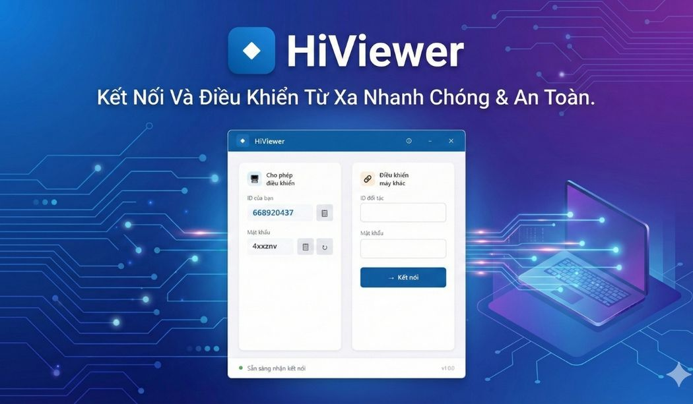
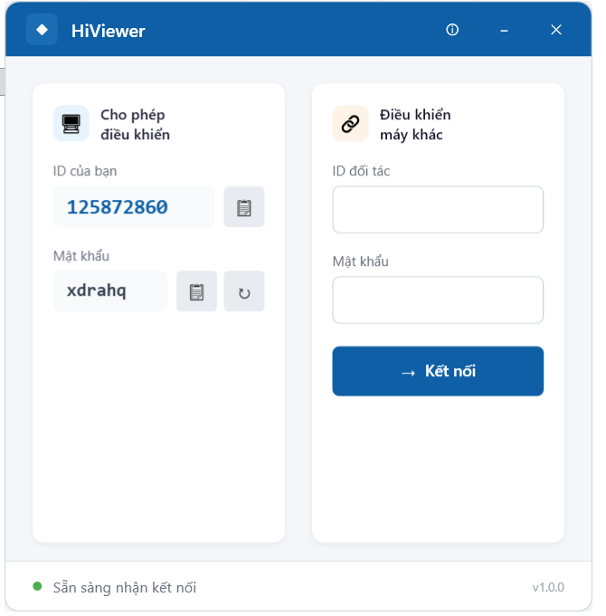

# HiViewer - Phần mềm Điều khiển Máy tính Từ xa

  

**HiViewer** là phần mềm điều khiển máy tính từ xa qua Internet, tương tự TeamViewer và UltraViewer. Được phát triển hoàn toàn bằng C# .NET 8.

## ✨ Tính năng

- 🖥️ **Điều khiển từ xa qua Internet** - Kết nối và điều khiển máy tính từ bất kỳ đâu
- 🖱️ **Điều khiển chuột** - Di chuyển, click, cuộn hoàn toàn mượt mà
- ⌨️ **Điều khiển bàn phím** - Gõ phím, phím tắt hoạt động đầy đủ
- 🔒 **Bảo mật** - Mỗi phiên có ID và Password riêng, chống tấn công timing
- 🚀 **Hiệu suất cực cao** - 60 FPS, Binary WebSocket, tối ưu triệt để
- 🔄 **Tự động kết nối lại** - Khi mất kết nối sẽ tự động thử kết nối lại
- 🛡️ **Ổn định** - Xử lý UAC, thay đổi độ phân giải, nhiều tình huống edge case
- 🎨 **Giao diện đẹp** - Thiết kế hiện đại theo phong cách TeamViewer

## 📥 Tải về

| Phiên bản | Tải về | Kích thước | Ghi chú |
|-----------|--------|------------|---------|
| **v1.1.3** (Mới nhất) | [HiViewer_Setup_v1.1.3.exe](HiViewer_Setup_v1.1.3.exe) | ~2.6 MB | **Fix lỗi kết nối lại** |

**Yêu cầu hệ thống:**
- Windows 10/11 (64-bit)
- .NET 8 Runtime ([Tải tại đây](https://dotnet.microsoft.com/download/dotnet/8.0))

## 🆕 Có gì mới trong v1.1.3

### Sửa lỗi quan trọng
- **Fix "Sai password" khi kết nối lại** - Lỗi Host không reset trạng thái sau khi Controller ngắt kết nối
- **Thêm event PartnerDisconnected** - Phân biệt rõ disconnect từ server vs từ partner

### Hiệu suất (từ v1.1.2)
- 60 FPS - Mượt mà tối đa
- Binary WebSocket - Giảm 33% dữ liệu
- Mouse throttling - Tối ưu băng thông

### Bảo mật (từ v1.1.0)
- Chống tấn công timing attack
- Rate limiting
- Validate ID format

## 🚀 Hướng dẫn sử dụng

### Cài đặt

1. Tải file `HiViewer_Setup_v1.1.3.exe`
2. Chạy file và làm theo hướng dẫn cài đặt
3. Khởi động HiViewer từ Desktop hoặc Start Menu

### Cho phép người khác điều khiển máy bạn

1. Mở HiViewer
2. Ghi nhớ **ID** và **Mật khẩu** hiển thị ở phần "Cho phép điều khiển"
3. Gửi ID và Mật khẩu cho người muốn điều khiển máy bạn

### Điều khiển máy tính khác

1. Mở HiViewer
2. Nhập **ID đối tác** vào ô ở phần "Điều khiển máy khác"
3. Nhấn **Kết nối**
4. Nhập **Mật khẩu** khi được yêu cầu
5. Bắt đầu điều khiển!

## 📸 Ảnh màn hình

  

## ❓ Câu hỏi thường gặp

### Tại sao không kết nối được?

- Kiểm tra kết nối Internet của cả 2 máy
- Đảm bảo nhập đúng ID và Mật khẩu
- Thử tắt tường lửa (Firewall) tạm thời

### Màn hình bị đen khi điều khiển?

- Đảm bảo máy được điều khiển không ở chế độ Sleep
- Thử đóng và mở lại kết nối

### Bàn phím không hoạt động?

- Click vào cửa sổ điều khiển từ xa để đảm bảo nó có focus
- Thử nhấn vào màn hình remote trước khi gõ

## 👨‍💻 Tác giả

- **TranQuoc** - [tduyquoc@gmail.com](mailto:tduyquoc@gmail.com)

## 🙏 Tri ân

Cảm ơn thầy **Nguyễn Tiến Dũng** đã hướng dẫn và hỗ trợ trong quá trình phát triển.

## 📄 Giấy phép

Phần mềm này được phát hành miễn phí cho mục đích cá nhân và giáo dục.

---

  Made with ❤️ in Vietnam

